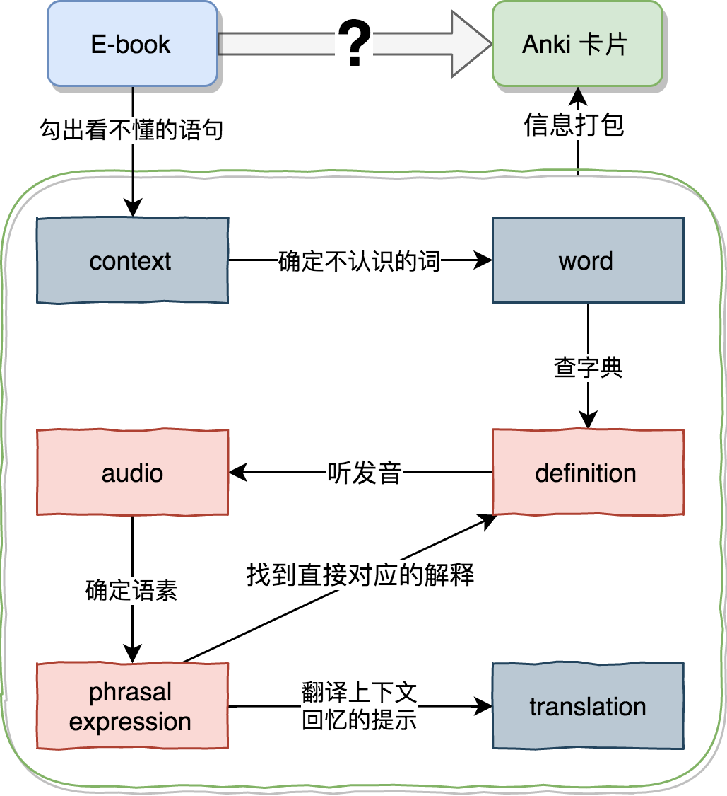

# 英文原著阅读与Anki制卡
## 1 关于Anki制卡的原则
语言是一种神奇的东西，它表达意思，更塑造大脑，是知识的载体，也是情绪的载体。学习一门全新的语言好处多到你简直不能拒绝......
* 扩展沟通的疆域，博古通今、拉近与世界的距离。
* 能够将沟通的内容与情绪剥离，推荐在亲密关系中使用英语吵架，不容易伤和气。
* 预防老年痴呆。
* 大概也与很多人获得更多的工作机会，更高的收入有关吧。

对我来说，让原来80分的英语提高到90分以上，与摆脱焦虑恐惧有关。我需要更精确的表达，也需要更不可替代的能力，才能更自由的活着。选择参加[小能熊]()的[365小黑书计划]()是因为喜欢`MzSavage老师`的[英语原技能课程]()，喜欢老师的声音和学习的原则:smile:。再则，之前尝试买了书，备了Kindle，还是没有办法自己一个人乖乖地做卡片、背单词。所以在第三期，某个焦虑的早晨，我决定按照要跑步先买装备的策略，把钱砸进去，就不会懈怠了。
在所有阻碍我刷卡的问题中，不知道到底应该制作什么样的卡片是核心问题。
### 1.1 语素原则
知识是以`network`的形式关联与储存的，需要构建网络，就必须先掌握节点。而语言学习基本单元并不是`word`（单词），而是`phrase expression`（语素）。对不同的语素来说，即使含有相同的单词成分，其意义上的联系也很微妙，有的时候太远没法联想，有的时候太近没法区分。
以前我就很讨厌动词搭配。看看这个例子：`think about` vs `think of`。
* `think of` 考虑,关心,想起,想象,有…的看法,记起。
* `think about` 考虑…;捉摸…;对…有(某种观点);回想起, 记起。

我的中文也烂，这么多年，也说不清，在我看来，它们就是一样的，都是`想`。与其说出来搭配的原则，为啥不直接就记住 `think of you`，`think about the plan`。能用的东西，才是能记住的东西，不然放进去的越多越乱。
拿字典背单词，其实是要让自己一次性装入联系并不紧密的多个内容。就像让只有2G内存的电脑干8G才能干的事情，你会觉得这个电脑开啥都慢，然后暴躁放弃。所以，字典中是 `a word -> mutiple definitions`，而我们真实的学习过程实际上是分解开的：
1. 阅读，`a context -> one phrase expression`。
2. 融汇，`mutiple phrasal expressions -> a word`。
### 1.2 反复重现，主动回想原则
[Anki]()是日语`暗记`的罗马音，本质上是根据`艾宾浩斯遗忘曲线`设计出了一套`电子手卡（flashcard）`。干的事情就是`反复重现`，而最后你之所以能记住，是在重现的时候，你完成了`主动回想`。所以，光看没用，还得想。但是，想和想还是不一样的。你喜欢书里面的颜如玉，我喜欢书里面的黄金屋，那看到自己喜欢的自然不由得多想一些，记得就更牢固一些。所以，刷自己做的卡肯定记得比刷别人做的卡牢固，前提是自己做的卡存在哈......
### 1.3 做卡原则
`Anki`这个软件提供的只是做卡和科学重现的工具，怎么做卡，你需要明白另外的一些原则。我推荐大家看看这篇文章[Anki Flashcard 13 Best Practices | How to Create Good Cards](https://medschoolinsiders.com/medical-student/anki-flashcard-best-practices-how-to-create-good-cards/)：
1. Keep Your Decks Simple 
2. First Understand, Then Memorize
3. Lay the Foundations First
4. Follow the Minimum Information Principle
5. Cloze Deletions Are Your Best Friend 多做填空（是不是最怕考填空呀）
6. Use Images, Photos, & Figures 用多媒体材料辅助记忆
7. Avoid Sets and Enumerations 不要堆砌，遍顺口溜把集合联系起来
7. Be Concise 简洁
8. Redundancy – Attack the Information From Different Angles 重复
>有小伙伴说有卡重复了，但是我发现有的新词换个样子我就不认识了，然后当我发现这两个词其实是一个词的名词和形容词形态，我就记住它了，我和它有了故事，交集，它伤害了我两次，我为它查了两次字典...

9. Provide Sources 提供来源，我们的就是上下文

10. Don’t Be Afraid to Edit or Delete 该改就改，该删就删

> 有的卡不太准确，有的卡忘记划重点了，刷别人的卡心存感谢，也要把自己的想法融进去。

11. Set a Daily Threshold for New Cards 每天背，参加活动的目标

## 2 什么是最适合小黑书阅读的制卡过程？
其实把原则用起来，就是很有难度。非常感谢做卡的小伙伴，在看了非常棒的卡，黑人问号脸卡之后，我才知道了自己想要啥，然后，才有了下面做卡的迭代。灵感来自[采采的卷耳](https://www.jianshu.com/p/5139f56057e6)，此处应有掌声。

### 2.1 阅读SOP -> 制卡SOP
少花时间`做`卡，多花时间`背`卡，我们需要`SOP`（stardand operating procedure）标准操作流程，我们来构建最可能的场景。 


从上面这个场景中，我们需要的信息包括：
1. a incomprehensible `context`：一边读一笔在Kindle里划线，全部导出。也可以是其他能导出划线文本的工具。
3. the unfamiliar `words`：一个上下文可能有多个完全不懂的词，这个是目前批量化做卡的一个问题。
2. the pinpointed `phrasal expression` and the critical `word`：Excel中，写出语素和需要查的词，然后倒入Anki。
5. the key `defenition` for the phrasal expression：Anki的查词插件查询后，需要自己划出其中与语素直接相关的部分。
6. the `translation` of the contxt：很多比喻的内容，需要翻译和一些说明来帮助理解。
4. the `pronouncation/audio`：利用HTML,在卡片中生成有道的发音链接。

然后，基于目前的最简便可得的实现方法，我确定了一张卡只有一个 `word` 的原则。也放弃了利用 Kindle批量导入，然后批量加工的方式。同意采采的卷耳，使用直接话词做卡，自动批量查词补齐解释的方式。此外，进行了一个**最重要的迭代**，这个版本将提供一个**完形填空**的**卡片模板**，用于深度记忆。

### 2.2 制卡前的必备知识
看到这里，我假设你是想要自己动手制作卡片的。那么除了，你必须知道一些关于Anki的基础知识背景。
1. Anki有2.1和2.0两个版本，目前都能使用，但是其内核是有区别的，能使用的Add-on也是不同的，很多针对2.0的Add-on已经没有维护了。比如2.0复制粘贴的时候回保留格式，2.1不会，只会留下如加粗这种最简单的格式。
* Deck & Card：很多`卡片`累成一`叠`，a deck of cards = 一副牌。
* Note and Filed: `卡片`是来源于`笔记`的，每个`笔记`包括很多`字段`，例如最简`字段`的`正面`和`反面`或者 `Front` 和 `Back`。我们可以通过字段的名字指代里面的内容，例如{{Front}}表示正面，但你也可以用{{正面}}，实际上这个到底是不是正面不重要，关键是这两对括号，而里面的名字是你自己取的。有含义很方面，没有含义，或者含义是错的也不影响功能。
* 有一些特殊的`域`Anki自定义的字段，能完成特殊的功能：
    - {{test:Front}}：比如{{Front}}里面的内容是 blabla "bla", "b"，使用左边的表示方式，这个内容就会被变成 blabla bla b，把不相干的东西都删了。
    - {{hint:Back}}：这个会把{{Back}}字段的内容隐藏起来，点击显示。
    - {{FrontSide}}，这个指的是`真正面`，是指你放在卡片正面所有东西。
    - {{type:Back}}：这就是真地狱级别完形填空，要求你把{{Back}}的内容打出来。
    - {{cloze:Cloze}}：这说明{{Cloze}}这个字段是用来填空的。
    - {{type:cloze:Cloze}}：把{{Cloze}}字段打出来。
    - {{c1::Apple}}，{{c1::Banana}}：专门识别`填空`位置，填空叫`cloze`，所以是c1，c2...

* CSS，JavaScript，HTML tag：这些内容全部都放在`卡片模板`里面，帮助我们调整卡片的外观，插入换行，音频等内容。你可以不知道这些修改，但是要理解它的功能。比如同样的一个 `note`， `basic`模板会生成一张卡片 `card`， `basic and reversed card`模板会生成两张卡片 `card`，一个看正面答背面，一个反之。你下载了用某个模板做的卡片集合，就相当于拥有了这个模板。
* Add-on：插件提供很多方便的功能，例如`Ankiconnection`帮助我们把网页上的内容直接制作成卡片。
* csv 和 apkg 是Anki常用的导入数据格式。


## 3 如何制卡
### 3.1 材料
* 字典
    - 小能熊提供了基本书，我喜欢用Oxford Advanced Learner's Dictionary-牛津双解
    - 所有mdx文件都可以。
* 电子书
    - PDF 需要使用PDF.js以网页形式打开。
> 只要让电子资料以网页的形式打开，就能使用后面的搭配制卡。你可以发挥想象。比如我用sublime把，md用网页预览，也是能取词的。另外，PDF毕竟不是网页，划词小助手出错的可能性比较大。
* 卡片模板
    - 基于 `OHD` 模板修改的 `HCC` (OHD是划词小助手的缩写，貌似)
    - HCC = hardcore cloze，硬核完形填空 :wink:。
        + 包括7个字段：Phrase，Context，Cloze，Translation，Word，Definition，Boolean。
        + 语素，上下文，完型填空，上下文翻译，关键词，关键词释义，布尔值
        + Word 并不出现在卡片的内容中，仅仅用来查询 Definition
        + Boolean 决定是不是要添加完型填空卡片，只要填了任何值，都会自动生成 `填空卡`，但是这个值本身不会出现在卡里，
    - 包括两张卡片
        + 填空卡：Context，Cloze，Translation （正在思考要不要增加发音）。
        + 学习卡：Phrase，Context，Translation (增加项)，Definition，Phrase的发音。

### 3.2 工具
*   Anki （V2.1）
    -   [Ankiconnection](https://ankiweb.net/shared/info/2055492159)：组件代码 2055492159，辅助制卡。
    -   [FastWQ](https://ankiweb.net/shared/info/1807206748)：组件代码 1807206748，完成同步多词查询  。
    -   [Word Query](https://ankiweb.net/shared/info/775418273) ：组件代码 775418273，完成单个查词 

*   Firefox
    -   [PDF.js](https://mozilla.github.io/pdf.js/)
    -   在线词典助手
> 虽然好多人用Chrome，但是它是有额外的困难的，懂伐。狐狸就没有，很多一开始在Chrome里开发的插件，也有移植到狐狸里面。

### 3.3 配置流程
#### 3.3.1 Anki
1. 安装Anki，确定是2.1，不然下面的号码会安装附加组件失败。
2. 打开 `Tool -> Add-on` 或者 `工具 -> 附加组件`，然后输入 `2055492159`，点 `OK`。
3. 重复上步，输入 `1807206748`，点 `OK`，重启。
4. 下载我的卡片模板，并且导入到Anki中。
5. 配置字典
    * Anki的菜单栏里面多了一个FastWQ，点击 `选项`
    * 选择字典文件所在的 `文档`，本身也自带很多在线字典，然后选择用在哪个模板上，这里选 `HCC`。
    * 选中 `Word`，说明用这个来查询。
    * 取消 `Definition` 上的忽略，查出来的内容就会被放到这里。
    * 跳过有项的值如果勾了，已经有内容的就不会查词了。
5. 让Anki不要休眠，Ankiconnection接不上。
    * 打开 Terminal，command+空格打开spotlight，输入terminal.app
    * 逐行输入

```
* defaults write net.ankiweb.dtop NSAppSleepDisabled -bool true
* defaults write net.ichi2.anki NSAppSleepDisabled -bool true
* defaults write org.qt-project.Qt.QtWebEngineCore NSAppSleepDisabled -bool true

```

#### 3.3.2 PDF.js
5. 下载[PDF.js](https://mozilla.github.io/pdf.js/) ，下了解压，就完成了。
6. 找到解压后的 `view.html`，双击这个文件，如果你的默认浏览器不是 Firefox，选择用Firefox打开它，因为我们的插件在火狐，用别的浏览器不可以。打开之后再把 `电子书PDF` **拖进去**，或者选择 `open file` 打开。
> 如果你不熟悉电脑，请记好 view.html 被你放在哪里，不然你会忘记。

#### 3.3.3 Firefox
1. 下载 [Firefox](http://www.firefox.com.cn/)并安装。
2. 打开 Firefox 安装 `Addon`，找组件的地方也是 `Tool -> Add-on` 或者 `工具 -> 附加组件`。
3. 寻找更多扩展，搜索`在线词典助手`，点进去，然后点 `添加到Firefox`。
4. 一般不需要重启浏览器，会出现一个 `A` 带红点的标记，点它就能完成配置。
5. 设置前必须先打开 `Anki`！！！不然怎么把词放进去。
5. 选择自动取词热键 `off`， 选择`笔记摘录脚本`，再选择一个你的 Anki 里面的 `Deck`，如果你没有看到这个选项就说明 助手没有找到 Anki，快去打开。
6. 设置界面有 `...`，点进去做进一步的设置。
7. 点击`输出选项`，这里你需要告诉助手，用什么卡片模板，划完 `语素` 之后怎么样生成卡片。这里可以有很多不一样的使用习惯，所以放到3.4中说明。


### 3.4 制卡流程
首先要说明的是，划词小助手会自动识别上下文！加粗查词的部分，如果是单词给出解释，如果是短语给出翻译。插件的运行不是很稳定，具体为什么还不是特别明白。起码要做到的是打开Anki，但不是浏览界面，据说要保持Anki激活。
如果制卡不成功，有两种情况：
1. 直接看到禁止的符号。
    * Ankiconnection没有连接上，这种情况是看不到Deck的下拉菜单的，这个时候插件可以当做字典。   
2. 点击➕之后出现的是❌，不是✅
    * 可能是没有选择存的 Deck。
>如果出问题，把Anki，Firefox全部关了，再打开，反正是哪里通信不对。

牢记7个字段：
* Phrase 划词，由于识别，可以多换一换划线的起始点
* Context 可以在小助手中修改
* Cloze
* Translation
* Word
* Definition 下划线标记
* Boolean

无论使用哪种划卡方式，
* Phrase <-> 单词词组
* Context <-> 原文笔记
* Translation <-> 单一释义


#### 3.4.1 小助手划词 OHD 学习卡
这张卡一开始就已经有雏形了，具体情况具体分析。
1. 完成 牛津高阶查词 的设置。
2. 给每个 `笔记 note` 都填入 `Word`，然后选中所有需要查的词，运行FastWQ，一次性完成界面中所有存在的 `Word`。
4. 下划线标记一词多义中最相关的含义。
5. 下划线标记 `Context` 中的 `Phrase`，也可以不标，那就只有加粗。
6. `Translation` 可能不准确，做修改。

> 你可以配置多个策略，然后用不同的字典来查，第二次就不要覆盖原来的结果。

#### 3.4.2 HCC 硬核完形填空
当卡片刚刚生成的时候是没有，完形填空这张卡的，因为 `Boolean` 字段是空的。当填入 `Boolean` 后，还需要 `Cloze` 字段的内容。
1. 进入`浏览`界面，选中一行，`Boolean` 中填入 1，或者任何值。
1. 在`Cloze`字段中输入上下文，一般从`Context`复制短一点的部分。
2. 选中项想作为完形填空的部分，然后点`[...]`图表，这个部分就会被`{{c1::}}`框上，我建议你，再改一改，变成`{{c1::要填的词::提示词}}`。有的时候有的词怎么也记不住，就给点提示吧。
3. 点 `卡片` 选项，然后在最顶端的下拉菜单，选择`填空卡`。
4. 或者，用`card:学习卡`进行筛选，选中所有的 `学习卡` ，然后点菜单中 `工具 -> 改变笔记类型`。类型还是选择 `硬核完型填空-HCC`，然后把两张卡的位置对换下，就会生成填空卡。
5. 如果有空字段的卡存在，退出浏览界面，点击 `工具 -> 空卡片`进行删除。

#### 3.4.3 其他说明

1. 一个笔记 `note` 有多个字段 `fileds`，一个笔记 `note` 可以生产多张卡片 `cards`，一个卡片 `card` 不用用所有的字段 `fileds`。
2. 查词的时候，大小写，动词的时态会导致查不出来，记得修改。
3. 音频是如何加入的？
    - 加入了一个超链接到有道的发音。
    - type 改变发音。
    - {{text:}}删除了字段中的标点。
```
<audio 
controls="controls" 
autoplay="autoplay" 
src="http://dict.youdao.com/dictvoice?audio={{text:Phrase}}&amp;type=2"
controls="controls">
</audio>

```

## 4 参考 
[[1] PDF.js使用](https://zhuanlan.zhihu.com/p/23870485) <br>
[[2] 划词助手更新](https://zhuanlan.zhihu.com/p/56393716) <br>
[[3] Anki划词助手使用](https://zhuanlan.zhihu.com/p/22472893) <br>
[[4] 输入填空卡片示例](https://stefanengineering.com/anki-type-cloze/)  <br>
[[5] 复制笔记add-on](https://ankiweb.net/shared/info/787914845) <br>
[[6] Anki官方帮助](https://apps.ankiweb.net/docs/manual.html) <br>
[[7] 采采的卷耳](https://www.jianshu.com/p/5139f56057e6) <br>
