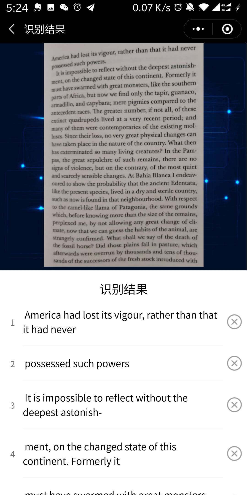
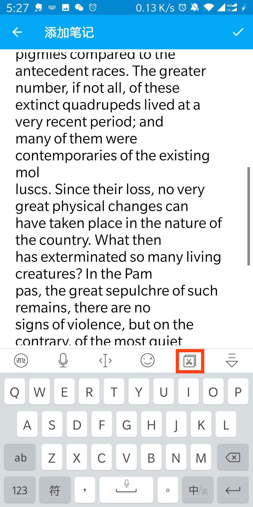

## 材料
* 纸书
* 微信识图取字
* 讯飞输入法（optional）我的手机到Anki里用粘贴没有反应，但是能在剪切板里找到，粘贴。

## 步骤
1. 手机拍照一页，剪切到只有页码内容
2. 识图，全部复制
3. 粘贴

### 粘贴1
* 新建一个Anki卡片，直接都粘贴到例句里面。
* 到电脑上再完成拆分
* 如果你使用带页码的卡片，也输入页字段

### 粘贴2
* 用微信发给自己
* 发页码信息
* 全部到手机上处理

