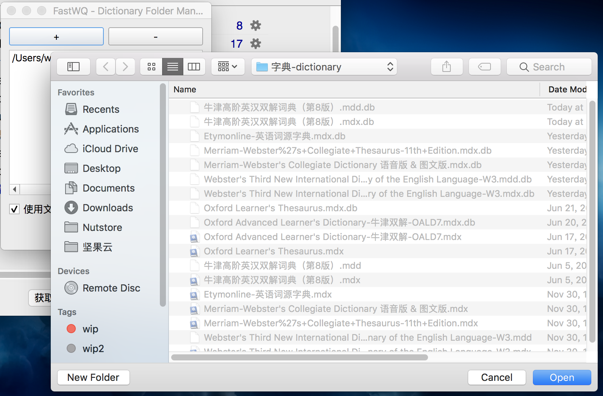

# 1 说明
* 使用插件 `Word Query`，或者其升级版 `Fast Word Query`，后者支持批量和多种查询设置。
* 查词是以某个字段作为查询内容，在给定的字典中查询，然后把查到的内容返回到指定的另外一个字段中。
* 我们通常可以用`句素`和`单词`作为查询字段，用`释义`存放查询到内容。
* 字典使用韦氏词典，牛津高阶，和网络释义。

# 2 准备
* Anki 2.1，不是2.0，也不是2.1 beta。
* Anki Add-on：打开 `工具 -> 附加组件` `Tools -> Addon`。在图中输入下面的一串数字，成功后重启。
    - FastWQ（`1807206748`，需要**配置字典**）
* 字典：小能熊提供，所有字典解压放到同一个文件夹，最后你拿到的是 `mdx` 或者 `mdd`。
    - 牛津高阶8版 [donwload]("请找小能熊")
    - 韦氏词典[donwload]("请找小能熊")

# 3 配置
## 3.1 配置内容说明：
* 字典在哪儿。
* 给哪个 `卡片` 查
* 用哪个 `字段` 查
* 查哪个 `字典`
* 查完了放到哪个 `字段`

1. 进入 `浏览 Browser`，点击 `FastWQ → 选项`设置字典。
> 注意选择的是 `字典所在文件夹`，不是任何一本字典。在字典界面你只能看到很多灰色不能选择的字典。mac里面按 cmd+↑ 能回到上级文件夹。

2. 点击`选择笔记类型`，下拉菜单，选 `小黑书文字卡片2.2`。

3. 配置，`谁` 有 `点` 查谁，`谁` 没 `忽略` 就把查到的内容存进去，下拉菜单选哪本字典，就从哪儿查。
7. 点击加号，能增加配置，绿色✅在哪儿，用哪个配置。
 
    - 配置一：查 `句素`，用牛津八。
    - 配置二：查 `单词`，用牛津八。
    - 配置三：查 `单词`，用韦氏词典。

> [[1] FastWQ 官方配置说明](https://github.com/sth2018/FastWordQuery)  
> [[2] WordQuery 官方配置说明](https://github.com/finalion/WordQuery)  
> FastWQ 来自 WordQuery 所以配置是一样的。 

# 4 查询步骤
1. 选中一张或者`多张`要查的卡片，保证类型一致。
2. 如果有多种设置，选中其中的一个设置。
3. 点击菜单栏中的查询。

# 5 常见问题
总的来说查词只要成功过一次，再用出错都是配置不匹配出现的问题。
* 笔记类型不匹配，查询的卡片的笔记类型必须和配置中一致。
* 插件中的配置和实际自己认为的不同。
* 查询 `单词` 但是，并没有编辑单词的内容。