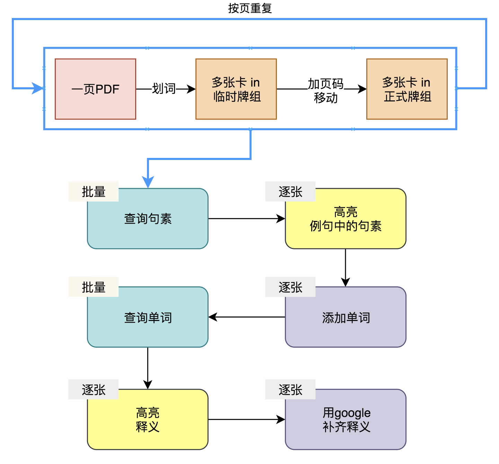

# 1 概述
一张 `合格的卡片` 应该**符合以下所有条件**，如果有任何步骤无法实现，请到群里求助。
* 卡片类型 `小黑书文字卡片2.2`。其中包括五个`字段` ：句素，例句，释义，单词，页码。
* `句素`：由老师勾画的最小应用、背诵单元。
* `例句`：句素的上下文。其中句素的部分**高亮**。
* `释义`：句素的字典释义。
    * 文本非图片，因为图片体积大，且无法查询其中的内容。
    * 句素的释义应**高亮**。
* `页码`：句素在书中的页码。页码必须是纯数字。
* `单词`：句素中最核心单词，通过这个词能查到对应的释义。这是**辅助**查词的字段，按个人习惯使用。

# 2 制卡技能
## 2.1 如何制卡确定句素和例句？
快速制卡的[方法和示例](./3.1-快速制卡方法.md)
 
常见错误：
* 将例句当句素；
* 例句中的句素没有**高亮**；
* 例句太长。

## 2.2 如何利用Anki插件查词？
插件查词的[方法和示例](./3.2-插件查词方法.md)
 
常见错误：
* 使用截图替代查词；
* 没有识别出正确的查询词汇，利用 `单词` 字段辅助查词；
* 没有对核心释义进行**高亮**。

## 2.3 如何高亮？
高亮的[方法和示例](3.3-卡片高亮方法.md)
 
常见错误：
* 以引号替代高亮。
* 没有以下划线或者粗体进行高亮。

## 2.4 如何添加数字页码？
页码添加的[方法和示例](3.4-卡片添加页码方法.md)
 
常见错误：例如当前卡片来自21页。
* 正确：`21`
* 错误：`p21`，`P21`，`21-25`

# 3 批量制卡的流程
## 3.1 制卡
1. 将同一页的卡片利用划词小助手制成卡片，放到同一个空牌组中。
2. 给所有卡片添加页码。
3. 移动到正式牌组中。重复以上步骤，直到做完卡片。

## 3.2 查词
4. 插件查句素
5. 人工检查句素高亮，并给查句素失败的笔记，加入单词
6. 插件查单词
6. 人工添加释义高亮
7. google补齐添加仍然缺少的释义，并高亮。

