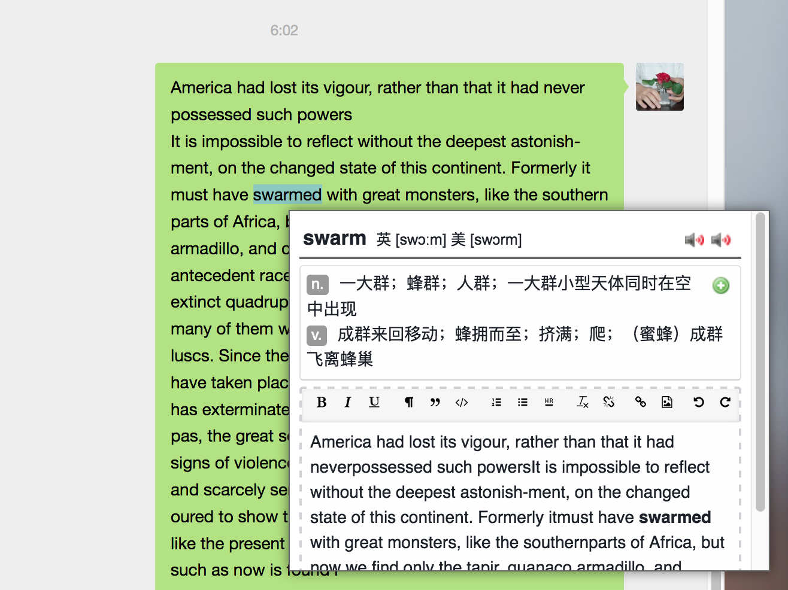

# 如何制作填空卡片（刻漏字卡片）
## 背景
填空卡片能让我们在单词使用情景下回忆，完成从认识到会用，结合填空的方式还能巩固拼写。根据现在小能熊已经有的卡片体系，我推荐的方式是，通过3步骤完成制作填空卡：
1. 哪张卡 = 第一遍刷卡，标注 `marked` 需要加深记忆的卡片。
2. 改模板 = 通过 `marked` 标签选中需要做卡片的 `note`，全部修改成 `cloze` 模板。
3. 做填空 = 在卡片中划出需要背诵的部分，并给出提示。

## 一些概念和知识
### 卡片类型（模板）转换
* `note` 可以根据 `fields` 进行不同 `templates` 的转换。 
    * 比如我们有 `template-A`，包括：`句素`和`例句`。
    * `tenplate-B`，包括：`句素`和`cloze`。
    * 将 `template-A` 转换为 `template-B` 时，就是告诉电脑，请用 `句素` 作为 `句素`，`例句`作为 `cloze`。
    * 选中多张相同模板的卡片，才能进行模板转化。

### 复制粘贴
* 非常神奇，Anki里面是不带复制粘贴功能的，因为Anki认为同一个模板 `template`如果第一个字段相同，那么这个就是一个重复 `note`。
* 实际操作会有不方便的地方，所以请下载复制的插件。
* 复制之后的卡片还保持原来的复习进度，所以为了能马上开始复习，需要把原有进度删除。

### 如何实现cloze
* 只有专门的cloze卡片模板才能做填空卡片，否则即使你在里面标记了，卡片中也不会有反应，还会报错。Anki本身自带 cloze 卡片，这里给的只是根据我们的需求美化了。
* 标记形式 
   * {{c1::挖走::提示}} {{c2::挖走::提示}} 放在卡片内容中。
   * 注意如果是c1，c2，就会做两张卡，如果大家都是c1，就会一次挖两个孔。
* **高级** `填空刻漏字`
   * 就是和名字一样高级，如果刻漏字理解成藏起来一个部分，填空刻漏字 需要你把缺少的部分打出来。
   * {{type:cloze:Cloze}} 这是放到卡片模板里面的。

### 一个模板两张卡（可以不看）
* 有一个必须知道的关键点，一个模板有两张或多张卡，谁排第一，谁决定了卡片的类型，所以cloze卡，只能把cloze类型放到第一。不然做的时候会报错。
* 这时候就出现一个问题，Anki默认的复习方法是，谁放第一，谁先出现。可是通常我们先学习卡片，然后再通过cloze的形式加深记忆。
* 有两个解决方案：
    * Plan A 单独做 `cloze模板`，与学习卡片相互独立。
    * Plan B 制作 `note` 的时候，先不要放 `cloze` 的内容，Anki默认如果一张卡片的正面没有内容，就不会生成这张卡片，所以，当有需求的时候添加 填空的内容，这张卡片才会出现。这么麻烦是有一定好处的，Anki对于一个模板下的两张卡片，可以设置复习的时候不同时显示。但是，考虑到可能现在你已经表示黑人脸，你在说什么。我选择了 Plan A。
    * 此外，根据小范围调查，大家可能更倾向，单独集中用填空来记住一些词，所以也就不存在我提到的上述优势了。
    
### 是否需要页码和数据（可以不看）
* 问题就是需要知道这张卡片来自哪里吗？
* 因为本来就有这个信息，在没有想清楚之前，先保留吧。

## 实现
### 原型 prototype
* 名字：hard-core cloze 硬核刻漏字 HCC
* 使用场景：已经存在一张包括用来背诵的卡片，需要通过强化拼写，记住重要词汇。也就是时候，制作 `cloze卡片`，**不需要查词**。
* 基于小黑书的卡片，提出以下字段，括号中是在小黑书中对应的字段：
    * 句素
    * 填空（例句）
    * 页码

### 准备
1. 安装复制插件 COPY notes `1566928056`。方法参考 [link](精简版.md)
2. 下载 填空模板 [link]()
### 卡片制作
1. 标记卡片（marked），手机和电脑都能完成，手机上回显示 ⭐️。
2. 搜索栏输入 `tag：marked` 选中所有的加星卡片。或者点右侧的 `marked` 这个 `tag`。
3. 按 `ctrl + C` 或者 `Cmd + C` 复制出要修改的卡片。
2. 鼠标右键，点修改卡片模板，**一定不要消除选中**，因为目前没有找到能再快速把这些卡片全部都选中的方法。
4. **保持选中**，全部移动到一个另外的 `Deck`.
5. 删除全部学习进度，重新排到复习卡片的最前面。
3. 在cloze filed中选中想作为填空的部分，按`[...]`键，然后手动输入::和要添加的提示。

