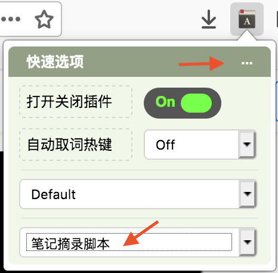
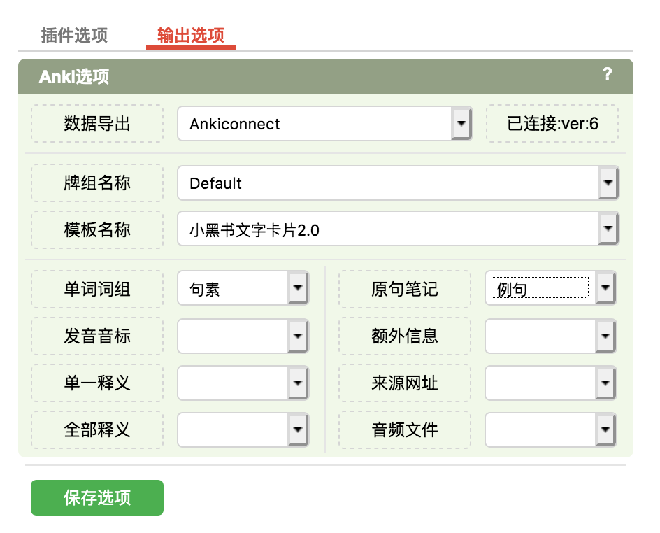
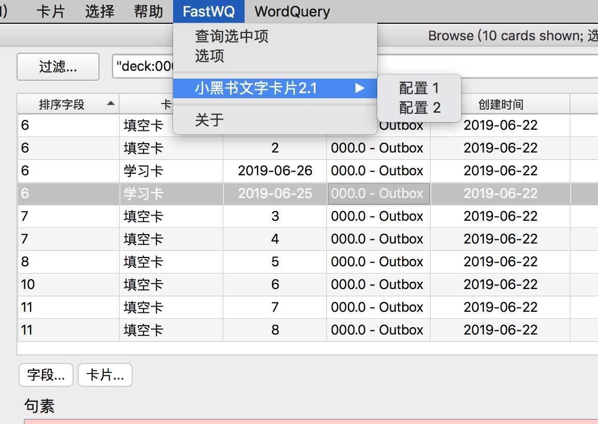
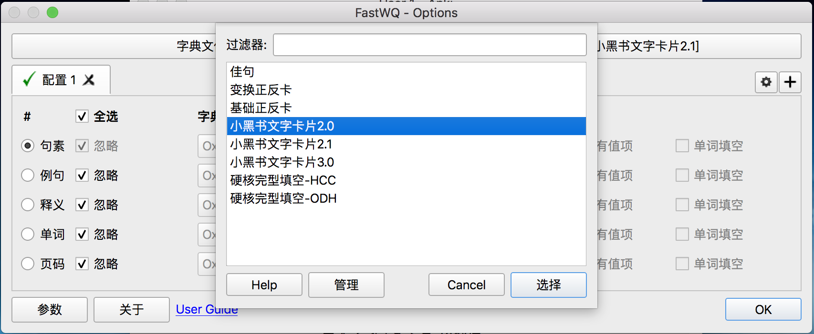
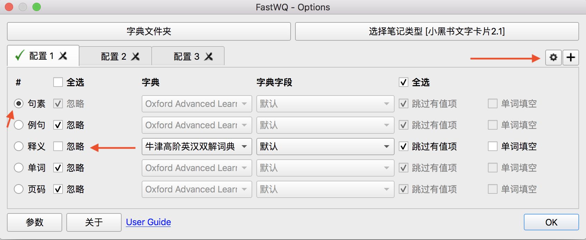
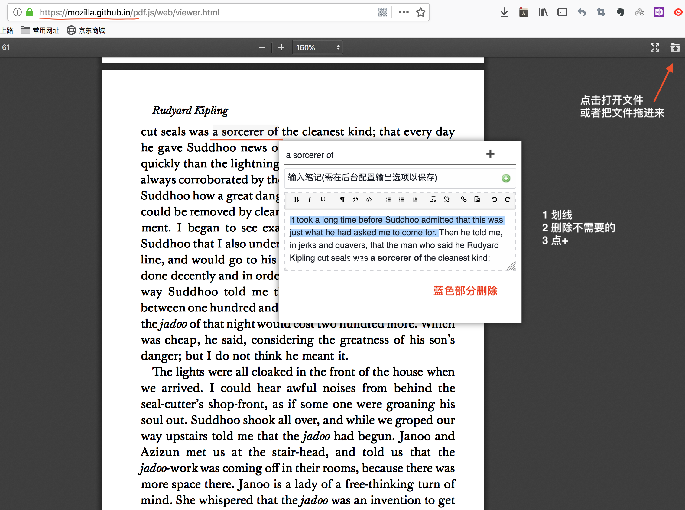
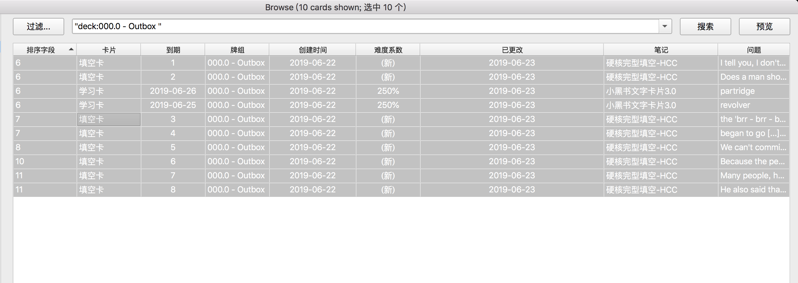

# SOP Anki PDF 划词制卡
## 1 字段说明
1. `句素`：可能是单词或者词组
2. `例句`：全部上下文，句素部分**下划线**，上下文就是一个自然句吗？
3. `释义`：关键的单词的释义，单词对应句素的解释用**下划线标记**
5. `单词`：辅助查词用，2.1增加
4. `页码`：辅助排序用，2.1增加

## 2 材料
* Anki 2.1，不是2.0，也不是2.1 beta。
* Anki Add-on：打开 `工具 -> 附加组件` `Tools -> Addon`。在图中输入下面的一串数字，成功后重启。
    - Ankiconnection（`2055492159`）
    - FastWQ（`1807206748`，需要**配置字典**）
* 卡片模板 小黑书文字卡2.1。[donwload]()
* 字典：小能熊提供，所有字典解压放到同一个文件夹，最后你拿到的是 `mdx` 或者 `mdd`。
    - 牛津高阶8版 [donwload]("待定")
    - 韦氏词典[donwload]("待定")
* Firefox 
    - `在线词典助手` （需要**配置**使用哪种 `卡片`）
    - `Tool -> Add-on` 或者 `工具 -> 附加组件`
    - 寻找更多扩展，搜索`在线词典助手`，点进去，然后点 `添加到Firefox
    - 会出现一个 `A` 带红点的标记，点它就能完成配置。
* PDF.js 直接下载解压，记住路径，和其中 `view.html` 的位置。[download](https://mozilla.github.io/pdf.js/)

* 材料清单
[x] Anki 2.1 [download](https://apps.ankiweb.net/)  
[x] Ankiconnection [download](https://ankiweb.net/shared/info/2055492159)  
[x] **FastWQ** [download](https://ankiweb.net/shared/info/1807206748)  
[x] 小黑书文字卡2.1 [download](https://www.jianguoyun.com/p/DZ3RM8IQ0b32BRiymc4B)  
[x] 牛津高阶8版 [download]("待定")  
[x] 韦氏词典 [donwload]("待定") 
[x] Firefox [download](http://www.firefox.com.cn/) 
[x] **在线词典助手**  [download](https://addons.mozilla.org/en-US/firefox/addon/ online-dictionary-helper/)  
[x] PDF.js [download](https://mozilla.github.io/pdf.js/) 

## 3 配置
### 3.1 在线词典助手
1. `Firefox` 中，点击 `A` 带红点的标记。 

1. 我们只做划句子，不查词。选择 `笔记摘录脚本`
1. 配置 `卡片` 放到哪个 `牌组`，图中是 `Default`。
1. 继续，点右上角的 `...` 进入设置界面。
2. 点红色 `输出选项`。
3. 首先，要连接 `Ankiconnection`。确保你安装了。
3. 选择 `小黑书文字卡片2.1`，然后按照图中，`单词词组 = 句素`，`原句笔记= 例句`。
3. 保存选项

> [[1]官方配置说明](https://www.laohuang.net/20180213/online-dictionary-helper/)

### 3.2 FastWQ
配置内容说明：
* 字典在哪儿。
* 给哪个 `卡片` 查
* 用哪个 `字段` 查
* 查哪个 `字典`
* 查完了放到哪个 `字段`

1. 进入 `浏览 Browser`，点击 `FastWQ → 选项`设置字典。
> 注意选择的是 `字典所在文件夹`，不是任何一本字典。在字典界面你只能看到很多灰色不能选择的字典。mac里面按 cmd+↑ 能回到上级文件夹。

2. 点击`选择笔记类型`，下拉菜单，选 `小黑书文字卡片2.1`。

3. 配置，`谁` 有 `点` 查谁，`谁` 没 `忽略` 就把查到的内容存进去，下拉菜单选哪本字典，就从哪儿查。
4. 配置一：查 `句素`，牛津八。
5. 配置二：查 `单词`，牛津八。
6. 配置三：查 `单词`，韦氏词典。
7. 点击加号，能增加配置，绿色✅在哪儿，用哪个配置。下拉菜单会有多个配置出现。

> [[1] FastWQ 官方配置说明](https://github.com/sth2018/FastWordQuery)  
> [[2] WordQuery 官方配置说明](https://github.com/finalion/WordQuery)  
> FastWQ 来自 WordQuery 所以配置是一样的。 

## 4 制卡流程
* **核心**：`批量`制作卡片，`批量`加入含义，`批量`调整细节。

### 4.1 不带页码的卡片
1. 找到 `PDF.js` 的 `view.html` 文件，双击，会打开一个PDF浏览器界面，选择把 `PDF` 拖进去。或者点打开文件按钮。
2. 划线，`在线词典助手` 导入 `句素` 和 `例句`。一个 `句素` 只做一张 `卡片`。`卡片` 内容导入 ``汇总-Deck` 中。
  
6. 进入 `Anki` 的 `浏览` （Browse）界面，选中 `汇总-Deck` 的 全部 `卡片`。 
   
4. 第一轮 `FastWQ` 查词，使用 `句素` 字段，`配置一`。
5. 检查查词结果。
    * 确认 `句素` 正确，且在 `例句` 中的勾选的位置正确。
    * 进行关键部分划线
    * 如果没有查出来，在 `单词` 字段中填入实际应该查询的 `单词`。  
6. 第二轮 `FastWQ` 查词，使用 `单词` 字段，`配置二`。
6. 检查查询结果。
    * 确认 `句素` 正确，且在 `例句` 中的勾选的位置正确。
    * 进行关键部分划线
7. 筛选 `释义` 为 `空` 的 `卡片`。
8. 使用 `韦氏词典` 进行补充，`配置三`。

### 4.2 一张卡片两个单词
因为一开始就让每个卡片只有一个句素，所以每个词都能被查到，但是有的卡片可以合并到一张。
1. 安装卡片生成时间排序。
2. 找到临近需要合并的卡片，打开其中一张的 `html编辑格式`，然后复制，再打开另一张的 `html 编辑`格式粘贴。
3. 删除不要的那张。

## 5 补充待定
* 为了能让卡片正常排序，需要添加页码字段。目前没有一个确定的说法，先放在这儿。
* 小黑书文字卡2.0和2.1的差别只有是否含有 单词和页码字段，所以是可以直接合并的。
### 带页码的卡片
1. `PDF.js` 打开 电子书。
2. 划线，`在线词典助手` 导入 `句素` 和 `例句`。一个 `句素` 只做一张 `卡片`。`卡片` 内容导入 `temp-Deck` 临时组，完成一页。
3. 进入 `Anki`，在 `temp-Deck` 中进行替换，把 `Page` 字段从 `空` 改为 `实际页码`。
4. 然后把所有的 `temp-Deck` 中的卡片移到，`汇总-Deck` 中。
5. 每一页重复制卡，直到把所有的卡片制作完成。
6. 进入 `Anki` 的 `浏览` （Browse）界面，选中 `汇总-Deck` 的 全部 `卡片`。 
4. 第一轮 `FastWQ` 查词，使用 `句素` 字段，`配置一`。
5. 检查查词结果。
    * 确认 `句素` 正确，且在 `例句` 中的勾选的位置正确。
    * 进行关键部分划线
    * 如果没有查出来，在 `单词` 字段中填入实际应该查询的 `单词`。  
6. 第二轮 `FastWQ` 查词，使用 `单词` 字段，`配置二`。
6. 检查查询结果。
    * 确认 `句素` 正确，且在 `例句` 中的勾选的位置正确。
    * 进行关键部分划线
7. 筛选 `释义` 为 `空` 的 `卡片`。
8. 使用 `google` 或者其他字典进行补充。
